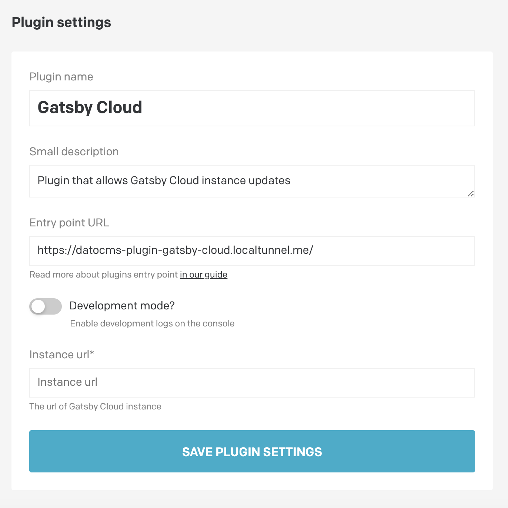
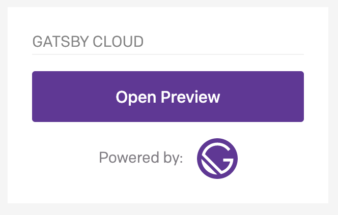

# Gatsby Cloud DatoCMS plugin

Plugin that allows access to Gatsby Cloud instances

## Configuration

Please specify a Gatsby Cloud preview instance url (required) and auth token (optional) in the plugin global settings.

## Plugin 

Once you've configured the plugin, you will be able to see it as a sidebar widget. 

